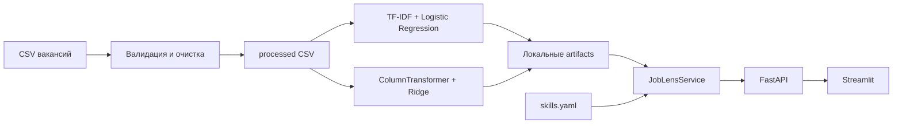

# JobLens ML

Production-style end-to-end ML-сервис для анализа русскоязычных IT-вакансий и прозрачного
сравнения вакансии с резюме. Проект включает подготовку CSV, обучение и оценку двух моделей,
эвристический match score, FastAPI, Streamlit, тесты, Docker и CI. Python 3.11.

JobLens помогает увидеть направление вакансии, требуемые и отсутствующие навыки,
ориентировочное текстовое соответствие и — если модель обучена — оценку зарплаты. Сервис
не принимает решений о найме и не оценивает людей автоматически.

## Интерфейс

> Screenshot placeholder: после локального запуска добавьте снимок Streamlit в
> `reports/figures/ui.png` и замените этот блок на изображение.

## Архитектура



## Данные

CSV поддерживает колонки:

`vacancy_id`, `name`, `description`, `key_skills`, `area`, `experience`, `employment`,
`schedule`, `salary_from`, `salary_to`, `salary_currency`, `salary_gross`, `published_at`,
`employer_id`.

Обязательны `vacancy_id`, `name`, `description`. `key_skills` может быть строкой через
запятую, JSON-списком или пустым. Скрипт проверяет колонки, удаляет HTML и дубликаты,
безопасно обрабатывает null, преобразует даты и сохраняет отдельный очищенный CSV, не
изменяя исходник. Для первой версии зарплата используется только в RUB/RUR; `salary_mid` —
среднее доступных границ либо единственная доступная граница. Значения вне 20 000–1 000 000
исключаются из salary target.

`scripts/generate_sample_data.py` создаёт маленький синтетический датасет исключительно для
проверки запуска. Он **не подходит для реальных метрик или вывода о качестве моделей**.
Проект не скачивает данные автоматически: реальный CSV положите в `data/raw/vacancies.csv`.

## Быстрый старт

Linux/macOS:

```bash
python3.11 -m venv .venv
source .venv/bin/activate
python -m pip install -e ".[dev]"
make sample-data prepare train-role train-salary test
```

Windows PowerShell (аналоги Makefile):

```powershell
py -3.11 -m venv .venv
.venv\Scripts\Activate.ps1
python -m pip install -e ".[dev]"
python scripts/generate_sample_data.py
python scripts/prepare_data.py
python scripts/train_role_classifier.py
python scripts/train_salary_model.py
python scripts/evaluate_models.py
python -m pytest
python -m ruff check .
python -m ruff format .
```

Все параметры путей, split, TF-IDF, LogisticRegression, Ridge, минимального размера данных,
весов matching и salary bounds находятся в `configs/config.yaml`.

## Запуск API и UI

После обучения в двух терминалах:

```bash
uvicorn joblens.api.main:app --reload
streamlit run src/joblens/ui/app.py
```

API: <http://localhost:8000>, Swagger: <http://localhost:8000/docs>, UI:
<http://localhost:8501>. Без моделей `/health` остаётся доступным; model-dependent endpoints
возвращают 503, а `/extract-skills`, `/match` и частичный `/analyze-vacancy` работают.

Примеры:

```bash
curl http://localhost:8000/health
curl -X POST http://localhost:8000/predict/role -H "Content-Type: application/json" -d '{"text":"Ищем Python разработчика FastAPI"}'
curl -X POST http://localhost:8000/extract-skills -H "Content-Type: application/json" -d '{"text":"Python, SQL и PyTorch"}'
curl -X POST http://localhost:8000/match -H "Content-Type: application/json" -d '{"resume_text":"Python SQL","vacancy_text":"Python SQL Docker"}'
curl -X POST http://localhost:8000/predict/salary -H "Content-Type: application/json" -d '{"description":"Python backend FastAPI","area":"Москва","experience":"1-3 года","employment":"Полная занятость","schedule":"Удалённая работа"}'
```

## Модели и оценка

Роль: baseline `DummyClassifier(most_frequent)` и TF-IDF (1–2 граммы, sublinear TF) плюс
balanced Logistic Regression. Классы создаются **по названию вакансии**, но название
**полностью исключено из признаков**; модель получает только `description + key_skills`.
Это предотвращает прямую target leakage. При достаточном количестве дат используется
хронологическое train/validation/test-разбиение с новыми строками в test, иначе —
stratified random split.

Зарплата: baseline `DummyRegressor(median)` и `ColumnTransformer`: TF-IDF описания, one-hot
категорий, scaled числовые признаки, затем Ridge. Обучение выполняется только на валидных
salary targets и использует согласованное разбиение.

| Задача | Baseline | Основная модель | Метрики |
|---|---|---|---|
| Роль | not trained yet | not trained yet | `artifacts/role_classifier/metrics.json` |
| Зарплата | not trained yet | not trained yet | `artifacts/salary_model/metrics.json` |

Здесь намеренно нет придуманных чисел. Скрипты сохраняют фактические JSON-метрики,
classification report и графики; после обучения таблицу можно обновить этими значениями.
Основная метрика классификации — macro F1, дополнительные — weighted F1, accuracy и
precision/recall по классам. Для зарплаты: MAE, median AE, MdAPE и R².

## Match score

`100 × (0.6 × TF-IDF cosine similarity + 0.4 × skill coverage)`, ограниченный диапазоном
0–100. Если в вакансии нет известных навыков, coverage нейтрален (0.5) и деления на ноль
нет. Match score — **эвристика, а не вероятность найма**. Проект не принимает решения о
найме и не гарантирует трудоустройство.

## Docker

Сначала обучите модели локально и оставьте доверенные `pipeline.joblib` в
`artifacts/role_classifier/` и `artifacts/salary_model/`; они исключены из git. Compose
монтирует `./artifacts` read-only:

```bash
docker compose up --build
```

API доступен на 8000, Streamlit — на 8501. Не загружайте непроверенные joblib-файлы:
десериализация предназначена только для доверенных локальных артефактов.

## Ограничения и улучшения

Качество зависит от состава, периода и полноты реального датасета. Слабые классы из
заголовков содержат шум; зарплаты публикуются выборочно; словарь навыков конечен; TF-IDF не
понимает глубокую семантику. Синтетический набор проверяет код, не качество. До production
нужны репрезентативные реальные данные, ручная проверка labels, анализ смещений, temporal
backtesting, калибровка вероятностей, мониторинг drift и контролируемый model registry.

## Структура

Основной код находится в `src/joblens/`: `data` отвечает за CSV, `features` — за тексты,
навыки и salary features, `models` — за pipeline/evaluation/persistence, `matching` — за
score, `service` — за единый inference lifecycle, `api` и `ui` — за интерфейсы. В `scripts`
находятся воспроизводимые entry points, в `tests` — автономные тесты, в `reports` — карточки
моделей и графики.

## Лицензия

MIT, см. `LICENSE`.

